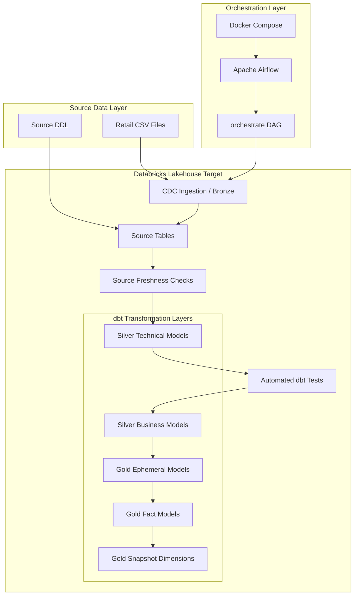

# Retail Analytics Airflow dbt Platform

An open-source, **retail data engineering platform** utilizing a **Medallion Architecture (Bronze/Silver/Gold)** to transform raw operational data into analytical assets. The pipeline ingests multi-domain retail source entities into **Databricks**, leveraging **dbt (Data Build Tool)** for modular SQL transformations, automated data quality testing, and snapshotting. The entire workflow is programmatically orchestrated using **Apache Airflow** within a localized **Docker container environment**.

## 📌 Architecture & Design

### High-Level Architecture


### Core Business Domains
The platform models data across 6 primary retail domains:
* **Customers** & **Employees** (CRM / Personnel)
* **Orders** & **Order Items** (Transactional Sales)
* **Products** & **Stores** (Master Inventory Data)

---

## 🔄 Data Pipeline & Execution Flow

1. **Ingestion (Bronze):** Raw transactional retail CSV datasets are parsed via DDL and loaded directly into the configured Databricks catalog and schema.
2. **Orchestration:** Airflow triggers the `orchestrate` DAG, clearing legacy targets and logs before validating source freshness thresholds.
3. **Cleansing & Enrichment (Silver):** Data is processed into standardized technical models, followed by downstream business logic mapping. Relational and schema integrity constraints are tested at each boundary.
4. **Analytical Optimization (Gold):** Aggregated metrics are materialized into dimension tables (tracked historically via dbt snapshots) and fact tables optimized for BI applications.

### Airflow Task Dependency Topology

```mermaid
flowchart LR
	ingest_cdc[Ingest CDC] --> clean_target[Clean Target/Logs]
	clean_target --> source_freshness[Verify Source Freshness]
	source_freshness --> silver_technical[Build Silver Technical]
	silver_technical --> silver_technical_tests[Validate Silver Tests]
	silver_technical_tests --> silver_business[Build Silver Business]
	silver_business --> silver_business_tests[Validate Business Tests]
	silver_business_tests --> gold_ephemeral[Compute Gold Ephemeral]
	gold_ephemeral --> gold_dimensions[Materialize Gold Dimensions]
	gold_dimensions --> gold_facts[Materialize Gold Facts]
```


---

## 📂 Repository Layout

```text
airflow_dbt_project/
├── dags/
│   └── orchestrate.py                  # Apache Airflow workflow definition
├── docker-compose.yaml                 # Localized multi-container Airflow stack
├── Dockerfile                          # Customized Airflow image with dbt drivers
├── requirements.txt                    # Python runtime package dependencies
└── retail_analytics_project/
    ├── dbt_project.yml                 # Global dbt configuration parameters
    ├── profiles.yml                    # Databricks endpoint & cluster connection profile
    ├── models/                         # Multi-hop SQL modeling layers (Sources, Silver, Gold)
    ├── snapshots/                      # Type-2 Slowly Changing Dimensions (SCD Type 2)
    └── tests/                          # Custom singular data quality tests
walmart_dataset/
├── data/                               # Sample retail transactional CSV files
└── ddl/
    └── walmart_schema.sql              # Raw target base DDL schema scripts
```

---

## 🚀 Local Deployment Setup

### Prerequisites
* **Docker Desktop** (with Docker Compose enabled)
* An active **Databricks Workspace** and active SQL Warehouse endpoint
* Databricks Host, personal access token (PAT), HTTP path, and target Catalog privileges

### 1. Configuration & Security
Before running the infrastructure, provide your connection properties in the configuration files listed below. 


* Modify connections in: `airflow_dbt_project/retail_analytics_project/profiles.yml`
* Modify workspace targets in: `airflow_dbt_project/dags/orchestrate.py`

### 2. Initialize and Start Airflow
Execute the commands below from the project's root directory to spin up the containerized environments:

```powershell
# Navigate into the deployment workspace
cd airflow_dbt_project

# Initialize metadata database schemas
docker compose up airflow-init

# Spin up core services in detached daemon mode
docker compose up -d
```
Access the webserver UI at **[http://localhost:8080](http://localhost:8080)**. Locate the `orchestrate` DAG, toggle it from **Paused** to **Active**, and manually trigger the execution run.

### 3. Direct dbt CLI Development (Optional)
To run, inspect, or troubleshoot SQL models bypassing the Airflow scheduler layer, execute commands directly via your local virtual environment or internal container bash:

```bash
cd airflow_dbt_project/retail_analytics_project

# Run assertions against upstream systems
dbt source freshness

# Build and execute structural tests
dbt run
dbt test

# Capture historical dimension snapshots
dbt snapshot
```

### 4. Teardown Infrastructure
To cleanly isolate, halt, and tear down the background containers:

```powershell
cd airflow_dbt_project
docker compose down
```