# Retail Analytics Airflow DBT

An open-source retail data engineering project that uses Apache Airflow to
orchestrate a dbt transformation pipeline on Databricks. The pipeline turns
retail source data such as customers, employees, orders, products, stores, and
order items into tested technical, business, and gold-layer models.

## Summary

- Apache Airflow schedules and coordinates the workflow.
- dbt manages SQL transformations, tests, snapshots, and source freshness.
- Databricks is the configured warehouse target.
- Docker Compose provides the local Airflow environment.
- The `walmart_dataset/` directory contains the sample CSV files and source DDL.

## Data Flow

1. Source CSV files are loaded into the configured Databricks catalog and schema.
2. Airflow runs the `orchestrate` DAG.
3. The DAG triggers Databricks CDC ingestion and cleans previous dbt targets/logs.
4. dbt checks source freshness.
5. Technical silver models are built and tested.
6. Business silver models are built and tested.
7. Gold ephemeral models and fact models are built.
8. dbt snapshots create historical dimension records.

The Airflow task dependency flow is:

```mermaid
flowchart LR
	ingest_cdc[Ingest CDC] --> clean_target[Clean target]
	clean_target --> source_freshness[Source freshness]
	source_freshness --> silver_technical[Silver technical]
	silver_technical --> silver_technical_tests[Silver technical tests]
	silver_technical_tests --> silver_business[Silver business]
	silver_business --> silver_business_tests[Silver business tests]
	silver_business_tests --> gold_ephemeral[Gold ephemeral]
	gold_ephemeral --> gold_dimensions[Gold dimensions]
	gold_dimensions --> gold_facts[Gold facts]
```



## Project Layout

```text
airflow_dbt_project/
├── dags/orchestrate.py                 Airflow workflow
├── docker-compose.yaml                 Local Airflow services
├── Dockerfile                           Custom Airflow image
├── requirements.txt                     Python dependencies
└── retail_analytics_project/
	├── dbt_project.yml                  dbt project configuration
	├── profiles.yml                     Databricks connection profile
	├── models/                          Source, silver, and gold models
	├── snapshots/                       Historical dimensions
	└── tests/                            Custom dbt tests
walmart_dataset/
├── data/                                Sample CSV files
└── ddl/walmart_schema.sql              Source schema
```

## Run Locally

### Prerequisites

- Docker Desktop with Docker Compose
- A Databricks workspace and SQL warehouse
- Databricks host, token, HTTP path, and catalog details

### Configure Databricks

Update the placeholders in:

- `airflow_dbt_project/retail_analytics_project/profiles.yml`
- `airflow_dbt_project/dags/orchestrate.py`

Do not commit real credentials. Use environment variables or a local secrets
configuration for personal development.

### Start Airflow

From the repository root:

```powershell
cd airflow_dbt_project
docker compose up airflow-init
docker compose up -d
```

Open Airflow at [http://localhost:8080](http://localhost:8080), enable the
`orchestrate` DAG, and trigger it manually. The DAG is paused when created by
default.

### Run dbt Directly

To run dbt without Airflow, execute these commands inside the dbt container or
an environment with the dependencies installed:

```bash
cd airflow_dbt_project/retail_analytics_project
dbt source freshness
dbt run
dbt test
dbt snapshot
```

### Stop Services

```powershell
cd airflow_dbt_project
docker compose down
```

## License and Attribution

The source dataset and project structure are reused under their applicable
open-source license. Review the original license and retain its notices when
redistributing or modifying this project.


